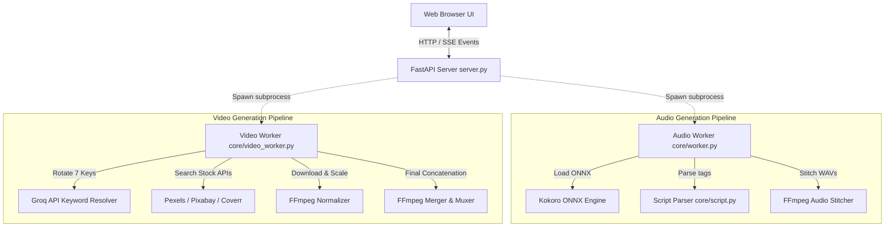
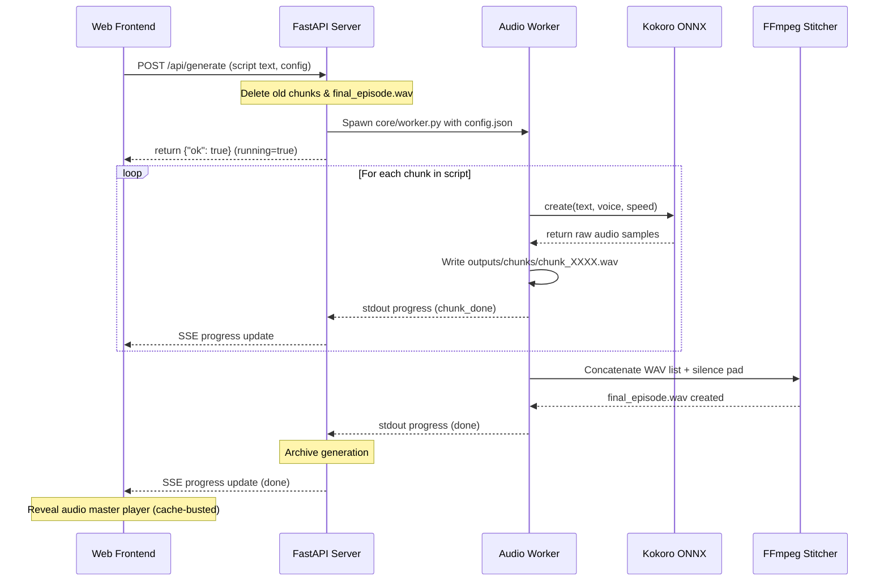
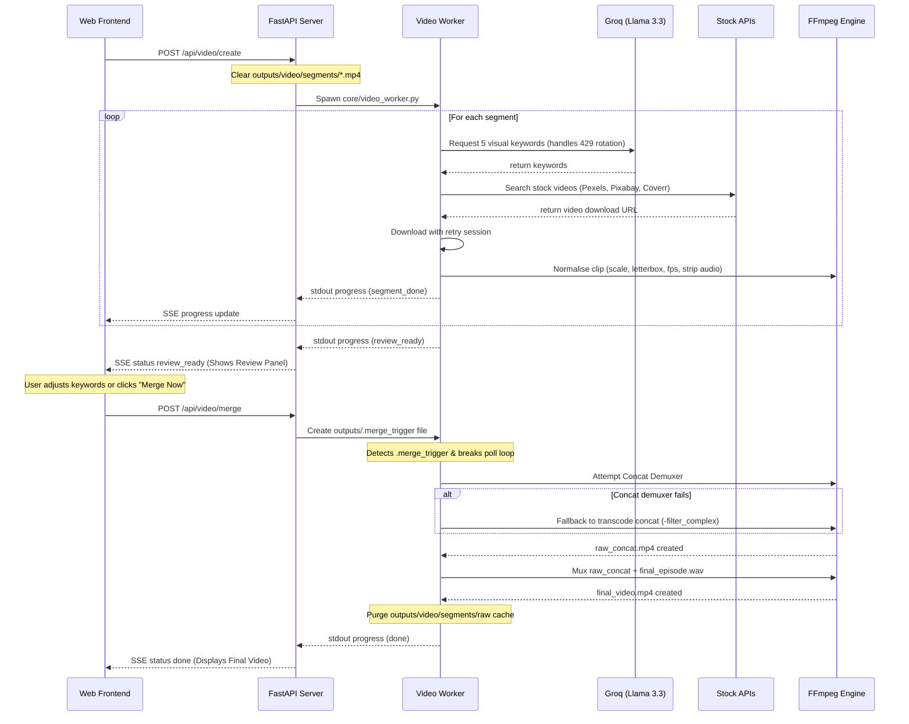

# 🏗️ Resonate AI Studio Architecture & Flow Diagrams

This document details the architectural design, component interactions, data flows, folder structures, and runtime specs of the Resonate AI voice and video generation studio.

---

## 1. High-Level Process Architecture

The system is designed with **strict process isolation** to isolate high-CPU/GPU operations (ONNX neural synthesis and FFmpeg transcoding) from the main web server process.



---

## 2. Audio Generation Pipeline Workflow

The audio generation worker parses the storytelling script, extracts speaker/emotion metadata tags, synthesizes WAV chunk clips locally using Kokoro-ONNX, and stitches them with configured silence padding.



---

## 3. Video B-Roll Generation Pipeline Workflow

The video pipeline extracts visual search queries using the 7-key Groq pool, queries stock video providers, scales clips to the target format, waits for user review, and compiles the final video.



---

## 4. Directory Manifest

Below is the file structure and organizational responsibilities across the studio project:

* **`/core`**: Core pipeline modules.
  * `audio.py`: Houses Kokoro TTS inference wraps, EBU R128 audio normalization, and segment stitching.
  * `model.py`: Model checkpoint verification and automatic weights downloader from GitHub Releases.
  * `script.py`: Script line tag regex parsers to separate speech overrides `[voice:af_sarah]` from raw script strings.
  * `video.py`: Media download engines, stock video API bridges, keyword extractor prompts, and FFmpeg transcode wraps.
  * `worker.py`: Background worker script spawned to perform sequential voice synthesis.
  * `video_worker.py`: Background worker script spawned to query keywords, download B-roll files, scale/pad segments, and perform final merging.
* **`/web`**: Pure vanilla HTML/CSS/JS frontend dashboard assets.
  * `index.html`: Responsive 3-column workspace structure and Stats drawer.
  * `style.css`: Glassmorphic dark styling.
  * `app.js`: Master JS coordinator mapping SSE streams, preview synchronization, and state management.
* **`/outputs`**: Local generated outputs and pipeline configs.
  * `/chunks/`: Houses individual generated WAV voice chunks.
  * `/video/segments/`: Houses scaled video B-roll clips (`segment_XXXX.mp4`).
  * `/video/segments/raw/`: Temporary stock downloads cache (automatically deleted on success).
  * `final_episode.wav`: Stitched, EBU R128 normalized master audio track.
  * `final_video.mp4`: Merged B-roll video with master voiceover.
  * `.groq_stats.json`: Internal stats database logging rotating API key metrics.
  * `history.json`: Archives of past generations.

---

## 5. JSON Schema & SSE Payload Specifications

### A. Groq Statistics Data (`outputs/.groq_stats.json`)
```json
{
  "gsk_key1prefix...": {
    "calls": 24,
    "success_calls": 23,
    "rate_limits": 1,
    "status": "active",
    "last_used": "2026-07-04T08:24:12Z"
  },
  "gsk_key2prefix...": {
    "calls": 12,
    "success_calls": 12,
    "rate_limits": 0,
    "status": "active",
    "last_used": "2026-07-04T08:25:01Z"
  }
}
```

### B. Live SSE Progress Stream Structure
Child worker processes write JSON strings to standard output, which the FastAPI server parses and streams to the client via Server-Sent Events (SSE):
```json
{
  "event": "status",
  "status": "generating",
  "message": "Voicing segment 3 of 8...",
  "current_chunk": 3,
  "total_chunks": 8
}
```

---

## 6. FFmpeg Codec & Command Reference

### A. Audio Segment Stitching with Silence Padding
Concats individual wav segments while inserting standard silent pauses (e.g., 0.5s gaps):
```bash
ffmpeg -y -i chunk_0000.wav -f lavfi -i anullsrc=r=24000:cl=mono -filter_complex "[0:a][1:a]concat=n=2:v=0:a=1[out]" -map "[out]" output.wav
```

### B. Standardized B-Roll Normalization (`_scale_clip`)
Forces mismatched stock video aspects or sizes into a consistent aspect ratio, resolution, and frame rate without audio streams:
```bash
ffmpeg -y -i raw.mp4 -vf "scale=1920:1080:force_original_aspect_ratio=decrease,pad=1920:1080:(ow-iw)/2:(oh-ih)/2:black,fps=30" -c:v libx264 -preset ultrafast -crf 28 -an standardized.mp4
```

### C. Concat Demuxer Fast Stitching
Lossless merge of pre-scaled video segments:
```bash
ffmpeg -y -f concat -safe 0 -i concat_file.txt -c:v libx264 -preset ultrafast -crf 28 -an output.mp4
```

### D. Transcode `-filter_complex` Fallback
Triggered dynamically if the concat demuxer fails due to custom uploaded content or frame rate mismatches:
```bash
ffmpeg -y -i segment_0000.mp4 -i segment_0001.mp4 -filter_complex "[0:v][1:v]concat=n=2:v=1:a=0[outv]" -map "[outv]" -c:v libx264 -preset ultrafast -crf 28 output.mp4
```

---

## 7. Playback Micro-Sync Engine (Frontend)

To allow real-time previewing of segment B-rolls alongside their matching voiceovers, `web/app.js` runs a drift-checking loop:

1. **Trigger**: When a user clicks preview, both the video element and the audio element (`chunk_XXXX.wav`) are started simultaneously. The video track is muted.
2. **Monitoring**: A `timeupdate` listener continuously compares the current playhead locations:
   $$\text{Drift} = | \text{Audio.currentTime} - \text{Video.currentTime} |$$
3. **Adjustment**: If $\text{Drift} > 0.150\text{ seconds}$ (150ms):
   * If the audio is lagging, the video is paused momentarily until the audio catches up.
   * If the audio is leading, the audio's `currentTime` is adjusted to match the video's active playhead, restoring perfect alignment.
