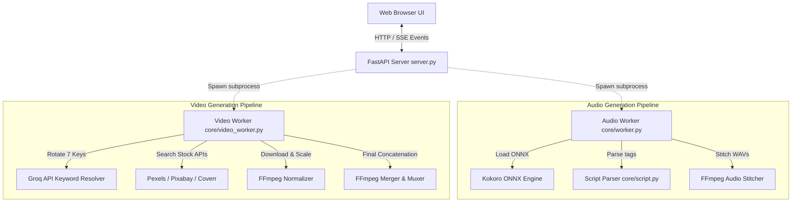
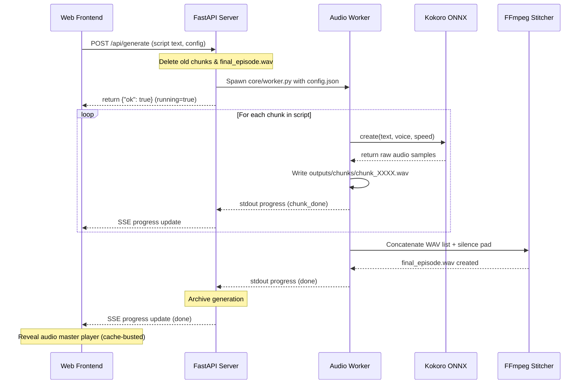
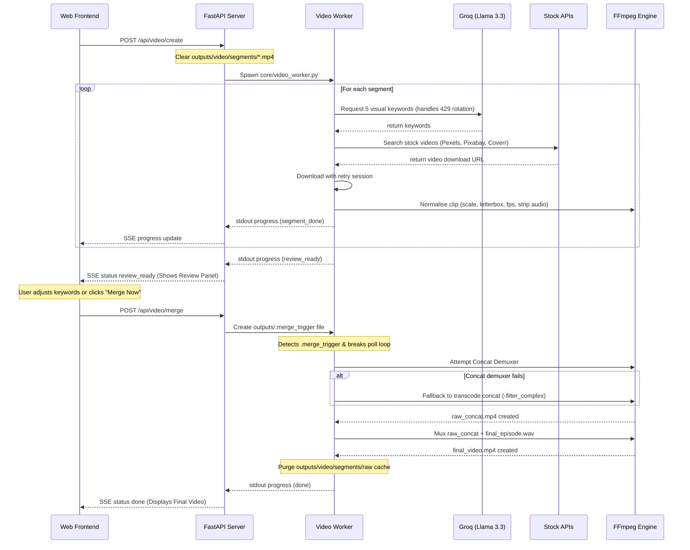

# 🏗️ Resonate AI Studio Architecture & Flow Diagrams

This document details the architectural design, component interactions, data flows, and concurrency protections of the Resonate AI voice and video generation studio.

---

## 1. High-Level Process Architecture

The system is designed with **strict process isolation** to isolate high-CPU/GPU operations (ONNX neural synthesis and FFmpeg transcoding) from the main web server process.



---

## 2. Audio Generation Pipeline Workflow

The audio generation worker parses the storytelling script, extracts speaker/emotion metadata tags, synthesizes WAV chunk clips locally using Kokoro-ONNX, and stitches them with configured silence padding.



---

## 3. Video B-Roll Generation Pipeline Workflow

The video pipeline extracts visual search queries using the 7-key Groq pool, queries stock video providers, scales clips to the target format, waits for user review, and compiles the final video.



---

## 4. Key Component Definitions

### A. Subprocess Pipe Communication
* Subprocesses write standard progress lines to standard output:
  `print(json.dumps({"event": "status", "status": "generating", "message": "..."}), flush=True)`
* The server reads standard output asynchronously line-by-line:
  `line = await _video_worker_process.stdout.readline()`
* To prevent deadlocks, child processes inherit the parent's error output (`stderr=None`), which outputs warning logs directly to the main terminal console instead of plugging a capped pipe buffer.

### B. Dynamic Groq Key Rotation Pool
* Keeps a state tracker in `outputs/.groq_stats.json`.
* If a request throws `HTTP 429` (Rate Limited), the extraction loop catches the exception, updates the key's state in the stats file, and seamlessly retries the API request with the next active key prefix.

### C. Standardized FFmpeg Normalization (`_scale_clip`)
* To ensure that the fast demuxer concat doesn't crash, every downloaded raw file is scaled, padded, and frame-rate aligned:
  ```bash
  ffmpeg -y -i raw.mp4 -vf "scale=1920:1080:force_original_aspect_ratio=decrease,pad=1920:1080:(ow-iw)/2:(oh-ih)/2:black,fps=30" -c:v libx264 -preset ultrafast -crf 28 -an standardized.mp4
  ```
